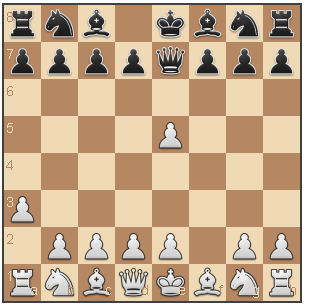
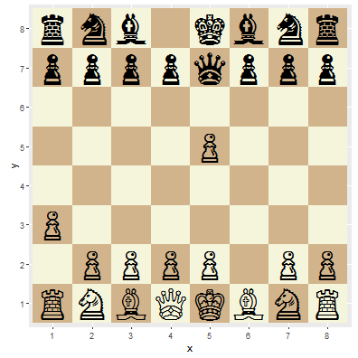
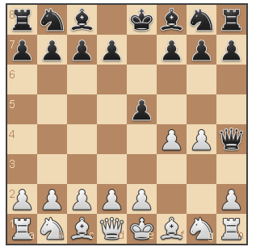
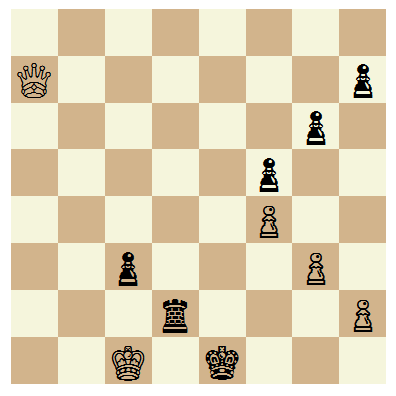

# rchess
<!-- README.md is generated from README.Rmd -->


[](https://travis-ci.org/jbkunst/rchess)
[](http://www.r-pkg.org/pkg/rchess)
[](http://www.r-pkg.org/pkg/rchess)

## Introduction

The `rchess` package is a chess move, generation/validation, piece placement/movement, and check/checkmate/stalemate detection.
 

## Installation

You can install the latest development version from github with:


```r
devtools::install_github("jbkunst/rchess")
```

## Basic Usage


```r
chss <- Chess$new()

chss
## 
## Turn
## w
## 
## Number of moves
## 0
## 
## History
## 
## 
## Fen representation
## rnbqkbnr/pppppppp/8/8/8/8/PPPPPPPP/RNBQKBNR w KQkq - 0 1
## 
## Board
##    +------------------------+
##  8 | r  n  b  q  k  b  n  r |
##  7 | p  p  p  p  p  p  p  p |
##  6 | .  .  .  .  .  .  .  . |
##  5 | .  .  .  .  .  .  .  . |
##  4 | .  .  .  .  .  .  .  . |
##  3 | .  .  .  .  .  .  .  . |
##  2 | P  P  P  P  P  P  P  P |
##  1 | R  N  B  Q  K  B  N  R |
##    +------------------------+
##      a  b  c  d  e  f  g  h

chss$moves()
##  [1] "a3"  "a4"  "b3"  "b4"  "c3"  "c4"  "d3"  "d4"  "e3"  "e4"  "f3" 
## [12] "f4"  "g3"  "g4"  "h3"  "h4"  "Na3" "Nc3" "Nf3" "Nh3"

chss$moves(verbose = TRUE)
## Source: local data frame [20 x 6]
## 
##    color  from    to flags piece   san
##    (chr) (chr) (chr) (chr) (chr) (chr)
## 1      w    a2    a3     n     p    a3
## 2      w    a2    a4     b     p    a4
## 3      w    b2    b3     n     p    b3
## 4      w    b2    b4     b     p    b4
## 5      w    c2    c3     n     p    c3
## 6      w    c2    c4     b     p    c4
## 7      w    d2    d3     n     p    d3
## 8      w    d2    d4     b     p    d4
## 9      w    e2    e3     n     p    e3
## 10     w    e2    e4     b     p    e4
## 11     w    f2    f3     n     p    f3
## 12     w    f2    f4     b     p    f4
## 13     w    g2    g3     n     p    g3
## 14     w    g2    g4     b     p    g4
## 15     w    h2    h3     n     p    h3
## 16     w    h2    h4     b     p    h4
## 17     w    b1    a3     n     n   Na3
## 18     w    b1    c3     n     n   Nc3
## 19     w    g1    f3     n     n   Nf3
## 20     w    g1    h3     n     n   Nh3

chss$move("a3")
```


We can concate some moves (and a captures)


```r
chss$move("e5")$move("f4")$move("Qe7")$move("fxe5")
```


```r
plot(chss)
```



(This is an image for the readme. The real one is a html document powered by [chessboarjs](http://chessboardjs.com/).
See [here](http://rpubs.com/jbkunst/rchess2))

Or a ggplot2 version (I know, I need to change the [chess pieces symbols in unicode](https://en.wikipedia.org/wiki/Chess_symbols_in_Unicode); maybe use a chess typeface)


```r
plot(chss, type = "ggplot")
```

 


```r

chss$turn()
## [1] "b"

chss$square_color("h1")
## [1] "light"

chss$get("e5")
## $type
## [1] "p"
## 
## $color
## [1] "w"

chss$history(verbose = TRUE)
## Source: local data frame [5 x 8]
## 
##   color  from    to flags piece   san captured number_move
##   (chr) (chr) (chr) (chr) (chr) (chr)    (chr)       (int)
## 1     w    a2    a3     n     p    a3       NA           1
## 2     b    e7    e5     b     p    e5       NA           2
## 3     w    f2    f4     b     p    f4       NA           3
## 4     b    d8    e7     n     q   Qe7       NA           4
## 5     w    f4    e5     c     p  fxe5        p           5

chss$history()
## [1] "a3"   "e5"   "f4"   "Qe7"  "fxe5"

chss$undo()
## $color
## [1] "w"
## 
## $from
## [1] "f4"
## 
## $to
## [1] "e5"
## 
## $flags
## [1] "c"
## 
## $piece
## [1] "p"
## 
## $captured
## [1] "p"
## 
## $san
## [1] "fxe5"

chss$history()
## [1] "a3"  "e5"  "f4"  "Qe7"

chss$fen()
## [1] "rnb1kbnr/ppppqppp/8/4p3/5P2/P7/1PPPP1PP/RNBQKBNR w KQkq - 1 3"

chss$header("White", "You")

chss$header("Black", "Me")

cat(chss$pgn())
## [White "You"]
## [Black "Me"]
## 
## 1. a3 e5 2. f4 Qe7

chss$ascii()
##    +------------------------+
##  8 | r  n  b  .  k  b  n  r |
##  7 | p  p  p  p  q  p  p  p |
##  6 | .  .  .  .  .  .  .  . |
##  5 | .  .  .  .  p  .  .  . |
##  4 | .  .  .  .  .  P  .  . |
##  3 | P  .  .  .  .  .  .  . |
##  2 | .  P  P  P  P  .  P  P |
##  1 | R  N  B  Q  K  B  N  R |
##    +------------------------+
##      a  b  c  d  e  f  g  h
```

## Load PGN and FEN

### FEN


```r
chssfen <- Chess$new()

fen <- "rnbqkbnr/pp1ppppp/8/2p5/4P3/8/PPPP1PPP/RNBQKBNR w KQkq c6 0 2"

chssfen$load(fen)
## [1] TRUE

chssfen$ascii()
##    +------------------------+
##  8 | r  n  b  q  k  b  n  r |
##  7 | p  p  .  p  p  p  p  p |
##  6 | .  .  .  .  .  .  .  . |
##  5 | .  .  p  .  .  .  .  . |
##  4 | .  .  .  .  P  .  .  . |
##  3 | .  .  .  .  .  .  .  . |
##  2 | P  P  P  P  .  P  P  P |
##  1 | R  N  B  Q  K  B  N  R |
##    +------------------------+
##      a  b  c  d  e  f  g  h
```

### PGN


```r
pgn <- system.file("extdata/pgn/kasparov_vs_topalov.pgn", package = "rchess")
pgn <- readLines(pgn, warn = FALSE)
pgn <- paste(pgn, collapse = "\n")
cat(pgn)
## [Event "Hoogovens A Tournament"]
## [Site "Wijk aan Zee NED"]
## [Date "1999.01.20"]
## [EventDate "?"]
## [Round "4"]
## [Result "1-0"]
## [White "Garry Kasparov"]
## [Black "Veselin Topalov"]
## [ECO "B06"]
## [WhiteElo "2812"]
## [BlackElo "2700"]
## [PlyCount "87"]
## 
## 1. e4 d6 2. d4 Nf6 3. Nc3 g6 4. Be3 Bg7 5. Qd2 c6 6. f3 b5
## 7. Nge2 Nbd7 8. Bh6 Bxh6 9. Qxh6 Bb7 10. a3 e5 11. O-O-O Qe7
## 12. Kb1 a6 13. Nc1 O-O-O 14. Nb3 exd4 15. Rxd4 c5 16. Rd1 Nb6
## 17. g3 Kb8 18. Na5 Ba8 19. Bh3 d5 20. Qf4+ Ka7 21. Rhe1 d4
## 22. Nd5 Nbxd5 23. exd5 Qd6 24. Rxd4 cxd4 25. Re7+ Kb6
## 26. Qxd4+ Kxa5 27. b4+ Ka4 28. Qc3 Qxd5 29. Ra7 Bb7 30. Rxb7
## Qc4 31. Qxf6 Kxa3 32. Qxa6+ Kxb4 33. c3+ Kxc3 34. Qa1+ Kd2
## 35. Qb2+ Kd1 36. Bf1 Rd2 37. Rd7 Rxd7 38. Bxc4 bxc4 39. Qxh8
## Rd3 40. Qa8 c3 41. Qa4+ Ke1 42. f4 f5 43. Kc1 Rd2 44. Qa7 1-0

chsspgn <- Chess$new()

chsspgn$load_pgn(pgn)
## [1] TRUE

cat(chsspgn$pgn())
## [Event "Hoogovens A Tournament"]
## [Site "Wijk aan Zee NED"]
## [Date "1999.01.20"]
## [EventDate "?"]
## [Round "4"]
## [Result "1-0"]
## [White "Garry Kasparov"]
## [Black "Veselin Topalov"]
## [ECO "B06"]
## [WhiteElo "2812"]
## [BlackElo "2700"]
## [PlyCount "87"]
## 
## 1. e4 d6 2. d4 Nf6 3. Nc3 g6 4. Be3 Bg7 5. Qd2 c6 6. f3 b5
## 7. Nge2 Nbd7 8. Bh6 Bxh6 9. Qxh6 Bb7 10. a3 e5 11. O-O-O Qe7
## 12. Kb1 a6 13. Nc1 O-O-O 14. Nb3 exd4 15. Rxd4 c5 16. Rd1 Nb6
## 17. g3 Kb8 18. Na5 Ba8 19. Bh3 d5 20. Qf4+ Ka7 21. Rhe1 d4
## 22. Nd5 Nbxd5 23. exd5 Qd6 24. Rxd4 cxd4 25. Re7+ Kb6
## 26. Qxd4+ Kxa5 27. b4+ Ka4 28. Qc3 Qxd5 29. Ra7 Bb7
## 30. Rxb7 Qc4 31. Qxf6 Kxa3 32. Qxa6+ Kxb4 33. c3+ Kxc3
## 34. Qa1+ Kd2 35. Qb2+ Kd1 36. Bf1 Rd2 37. Rd7 Rxd7
## 38. Bxc4 bxc4 39. Qxh8 Rd3 40. Qa8 c3 41. Qa4+ Ke1 42. f4 f5
## 43. Kc1 Rd2 44. Qa7 1-0

chsspgn$history()
##  [1] "e4"    "d6"    "d4"    "Nf6"   "Nc3"   "g6"    "Be3"   "Bg7"  
##  [9] "Qd2"   "c6"    "f3"    "b5"    "Nge2"  "Nbd7"  "Bh6"   "Bxh6" 
## [17] "Qxh6"  "Bb7"   "a3"    "e5"    "O-O-O" "Qe7"   "Kb1"   "a6"   
## [25] "Nc1"   "O-O-O" "Nb3"   "exd4"  "Rxd4"  "c5"    "Rd1"   "Nb6"  
## [33] "g3"    "Kb8"   "Na5"   "Ba8"   "Bh3"   "d5"    "Qf4+"  "Ka7"  
## [41] "Rhe1"  "d4"    "Nd5"   "Nbxd5" "exd5"  "Qd6"   "Rxd4"  "cxd4" 
## [49] "Re7+"  "Kb6"   "Qxd4+" "Kxa5"  "b4+"   "Ka4"   "Qc3"   "Qxd5" 
## [57] "Ra7"   "Bb7"   "Rxb7"  "Qc4"   "Qxf6"  "Kxa3"  "Qxa6+" "Kxb4" 
## [65] "c3+"   "Kxc3"  "Qa1+"  "Kd2"   "Qb2+"  "Kd1"   "Bf1"   "Rd2"  
## [73] "Rd7"   "Rxd7"  "Bxc4"  "bxc4"  "Qxh8"  "Rd3"   "Qa8"   "c3"   
## [81] "Qa4+"  "Ke1"   "f4"    "f5"    "Kc1"   "Rd2"   "Qa7"

chsspgn$history(verbose = TRUE)
## Source: local data frame [87 x 8]
## 
##    color  from    to flags piece   san captured number_move
##    (chr) (chr) (chr) (chr) (chr) (chr)    (chr)       (int)
## 1      w    e2    e4     b     p    e4       NA           1
## 2      b    d7    d6     n     p    d6       NA           2
## 3      w    d2    d4     b     p    d4       NA           3
## 4      b    g8    f6     n     n   Nf6       NA           4
## 5      w    b1    c3     n     n   Nc3       NA           5
## 6      b    g7    g6     n     p    g6       NA           6
## 7      w    c1    e3     n     b   Be3       NA           7
## 8      b    f8    g7     n     b   Bg7       NA           8
## 9      w    d1    d2     n     q   Qd2       NA           9
## 10     b    c7    c6     n     p    c6       NA          10
## ..   ...   ...   ...   ...   ...   ...      ...         ...
```

## Validation Functions

### State validation


```r
chss2 <- Chess$new("rnb1kbnr/pppp1ppp/8/4p3/5PPq/8/PPPPP2P/RNBQKBNR w KQkq - 1 3")
```


```r
plot(chss2)
```


(This is an image for the readme. The real one is a html document powered by [chessboarjs](http://chessboardjs.com/).
See [here](http://rpubs.com/jbkunst/rchess2))


```r
chss2$in_check()
## [1] TRUE

chss2$in_checkmate()
## [1] TRUE
```

### Slatemate validation


```r
chss3 <- Chess$new("4k3/4P3/4K3/8/8/8/8/8 b - - 0 78")

chss3$ascii()
##    +------------------------+
##  8 | .  .  .  .  k  .  .  . |
##  7 | .  .  .  .  P  .  .  . |
##  6 | .  .  .  .  K  .  .  . |
##  5 | .  .  .  .  .  .  .  . |
##  4 | .  .  .  .  .  .  .  . |
##  3 | .  .  .  .  .  .  .  . |
##  2 | .  .  .  .  .  .  .  . |
##  1 | .  .  .  .  .  .  .  . |
##    +------------------------+
##      a  b  c  d  e  f  g  h

chss3$in_stalemate()
## [1] TRUE
```

### Three fold repetition


```r
chss4 <- Chess$new("rnbqkbnr/pppppppp/8/8/8/8/PPPPPPPP/RNBQKBNR w KQkq - 0 1")

chss4$in_threefold_repetition()
## [1] FALSE

chss4$move('Nf3')$move('Nf6')$move('Ng1')$move('Ng8')

chss4$in_threefold_repetition()
## [1] FALSE

chss4$move('Nf3')$move('Nf6')$move('Ng1')$move('Ng8')

chss4$in_threefold_repetition()
## [1] TRUE

chss4$history()
## [1] "Nf3" "Nf6" "Ng1" "Ng8" "Nf3" "Nf6" "Ng1" "Ng8"
```

### Insufficient material

```r
chess5 <- Chess$new("k7/8/n7/8/8/8/8/7K b - - 0 1")

plot(chess5, type = "ggplot")
```

 

```r

chess5$insufficient_material()
## [1] TRUE
```

## Not api functions

## History for move of each piece

We can check the final board status with the (last) fen and the
`history_moves_pieces` filtering by `status == "game over"`


```r
chsspgn$history_moves_pieces()
## Source: local data frame [92 x 7]
## 
##           name start_position  from    to number_move   status
##          (chr)          (chr) (chr) (chr)       (int)    (chr)
## 1      a1 Rook             a1    a1    d1          21       NA
## 2      a1 Rook             a1    d1    d4          29       NA
## 3      a1 Rook             a1    d4    d1          31       NA
## 4      a1 Rook             a1    d1    d4          47 captured
## 5    b1 Knight             b1    b1    c3           5       NA
## 6    b1 Knight             b1    c3    d5          43 captured
## 7    c3 Bishop             c1    c1    e3           7       NA
## 8    c3 Bishop             c1    e3    h6          15 captured
## 9  White Queen             d1    d1    d2           9       NA
## 10 White Queen             d1    d2    h6          17       NA
## ..         ...            ...   ...   ...         ...      ...
## Variables not shown: piece_number_move (int)

ggchessboard(chsspgn$fen())
```

 

```r

library("dplyr")
## 
## Attaching package: 'dplyr'
## 
## The following objects are masked from 'package:stats':
## 
##     filter, lag
## 
## The following objects are masked from 'package:base':
## 
##     intersect, setdiff, setequal, union
chss$history_moves_pieces() %>% filter(status == "game over")
## Source: local data frame [32 x 7]
## 
##           name start_position  from    to number_move    status
##          (chr)          (chr) (chr) (chr)       (int)     (chr)
## 1      a1 Rook             a1    a1    NA          NA game over
## 2    b1 Knight             b1    b1    NA          NA game over
## 3    c3 Bishop             c1    c1    NA          NA game over
## 4  White Queen             d1    d1    NA          NA game over
## 5   White King             e1    e1    NA          NA game over
## 6    f1 Bishop             f1    f1    NA          NA game over
## 7    g1 Knight             g1    g1    NA          NA game over
## 8      h1 Rook             h1    h1    NA          NA game over
## 9      a2 Pawn             a2    a2    a3           1 game over
## 10     b2 Pawn             b2    b2    NA          NA game over
## ..         ...            ...   ...   ...         ...       ...
## Variables not shown: piece_number_move (int)
```


## Under the hood

This package is basically a wrapper of [chessjs](https://github.com/jhlywa/chess.js) by [jhlywa](https://github.com/jhlywa).

The main parts in this package are:

- V8 package and chessjs javascript library.
- R6 package for the OO system.
- htmlwidget package and chessboardjs javascript library.

Thanks to the creators and maintainers of these packages and libraries.


## Session Info


```r
print(sessionInfo())
## R version 3.2.0 (2015-04-16)
## Platform: i386-w64-mingw32/i386 (32-bit)
## Running under: Windows 7 (build 7601) Service Pack 1
## 
## locale:
## [1] LC_COLLATE=Spanish_Chile.1252  LC_CTYPE=Spanish_Chile.1252   
## [3] LC_MONETARY=Spanish_Chile.1252 LC_NUMERIC=C                  
## [5] LC_TIME=Spanish_Chile.1252    
## 
## attached base packages:
## [1] stats     graphics  grDevices utils     datasets  methods   base     
## 
## other attached packages:
## [1] dplyr_0.4.3        ggplot2_1.0.1.9003 rchess_0.1        
## 
## loaded via a namespace (and not attached):
##  [1] Rcpp_0.12.1      rstudioapi_0.3.1 knitr_1.11       magrittr_1.5    
##  [5] munsell_0.4.2    colorspace_1.2-6 R6_2.1.1         stringr_1.0.0   
##  [9] plyr_1.8.3       tools_3.2.0      parallel_3.2.0   grid_3.2.0      
## [13] gtable_0.1.2     DBI_0.3.1        ggthemes_3.0.0   htmltools_0.2.6 
## [17] lazyeval_0.1.10  yaml_2.1.13      assertthat_0.1   digest_0.6.8    
## [21] formatR_1.2.1    htmlwidgets_0.5  curl_0.9.3       evaluate_0.8    
## [25] rmarkdown_0.8.1  V8_0.9           stringi_0.5-5    scales_0.3.0    
## [29] jsonlite_0.9.17
```
