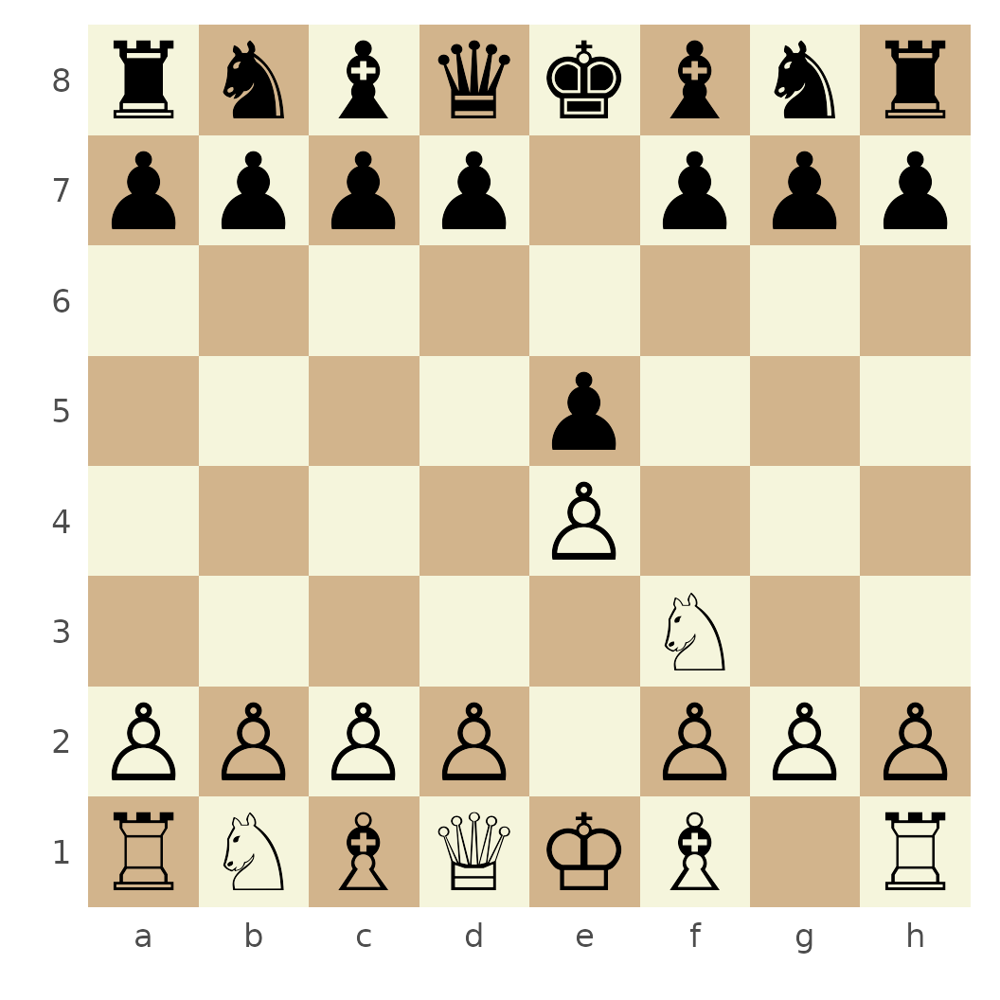
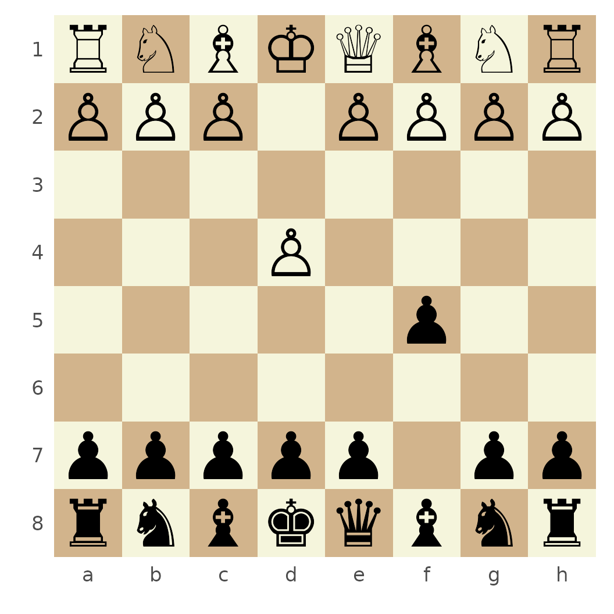

# Complete rchess tour

This article updates the complete example that originally lived on the
`gh-pages` branch. It follows a game from its initial position through
move history, FEN and PGN loading, game-state validation, and
visualization.

## Start a game

Create a game in the standard starting position and inspect its legal
moves:

``` r

game <- Chess$new()
game$moves()
#>  [1] "a3"  "a4"  "b3"  "b4"  "c3"  "c4"  "d3"  "d4"  "e3"  "e4"  "f3"  "f4" 
#> [13] "g3"  "g4"  "h3"  "h4"  "Na3" "Nc3" "Nf3" "Nh3"
game$moves(verbose = TRUE)
#> # A tibble: 20 × 6
#>    color from  to    flags piece san  
#>    <chr> <chr> <chr> <chr> <chr> <chr>
#>  1 w     a2    a3    n     p     a3   
#>  2 w     a2    a4    b     p     a4   
#>  3 w     b2    b3    n     p     b3   
#>  4 w     b2    b4    b     p     b4   
#>  5 w     c2    c3    n     p     c3   
#>  6 w     c2    c4    b     p     c4   
#>  7 w     d2    d3    n     p     d3   
#>  8 w     d2    d4    b     p     d4   
#>  9 w     e2    e3    n     p     e3   
#> 10 w     e2    e4    b     p     e4   
#> 11 w     f2    f3    n     p     f3   
#> 12 w     f2    f4    b     p     f4   
#> 13 w     g2    g3    n     p     g3   
#> 14 w     g2    g4    b     p     g4   
#> 15 w     h2    h3    n     p     h3   
#> 16 w     h2    h4    b     p     h4   
#> 17 w     b1    a3    n     n     Na3  
#> 18 w     b1    c3    n     n     Nc3  
#> 19 w     g1    f3    n     n     Nf3  
#> 20 w     g1    h3    n     n     Nh3
```

Moves use Standard Algebraic Notation and can be chained:

``` r

game$move("e4")$move("e5")$move("Nf3")$move("Nc6")
game$history()
#> [1] "e4"  "e5"  "Nf3" "Nc6"
game$history(verbose = TRUE)
#> # A tibble: 4 × 7
#>   color from  to    flags piece san   number_move
#>   <chr> <chr> <chr> <chr> <chr> <chr>       <int>
#> 1 w     e2    e4    b     p     e4              1
#> 2 b     e7    e5    b     p     e5              2
#> 3 w     g1    f3    n     n     Nf3             3
#> 4 b     b8    c6    n     n     Nc6             4
```

Inspect the current position and active side:

``` r

game$turn()
#> [1] "w"
game$fen()
#> [1] "r1bqkbnr/pppp1ppp/2n5/4p3/4P3/5N2/PPPP1PPP/RNBQKB1R w KQkq - 2 3"
game$get("e4")
#> $type
#> [1] "p"
#> 
#> $color
#> [1] "w"
game$square_color("h1")
#> [1] "light"
```

Undo the latest move or print the board in the console:

``` r

game$undo()
#> $color
#> [1] "b"
#> 
#> $from
#> [1] "b8"
#> 
#> $to
#> [1] "c6"
#> 
#> $flags
#> [1] "n"
#> 
#> $piece
#> [1] "n"
#> 
#> $san
#> [1] "Nc6"
game$ascii()
#>    +------------------------+
#>  8 | r  n  b  q  k  b  n  r |
#>  7 | p  p  p  p  .  p  p  p |
#>  6 | .  .  .  .  .  .  .  . |
#>  5 | .  .  .  .  p  .  .  . |
#>  4 | .  .  .  .  P  .  .  . |
#>  3 | .  .  .  .  .  N  .  . |
#>  2 | P  P  P  P  .  P  P  P |
#>  1 | R  N  B  Q  K  B  .  R |
#>    +------------------------+
#>      a  b  c  d  e  f  g  h
```

## Render the board

[`plot()`](https://rdrr.io/r/graphics/plot.default.html) returns an
interactive chessboard.js widget by default:

``` r

plot(game)
```

Use `type = "ggplot"` for a static ggplot2 board:

``` r

plot(game, type = "ggplot")
```



You can also render any FEN position directly:

``` r

fen <- "rnbqkbnr/pp1ppppp/8/2p5/4P3/8/PPPP1PPP/RNBQKBNR w KQkq c6 0 2"
ggchessboard(fen, perspective = "black")
```



## Load FEN positions

Create a game from FEN or replace the position of an existing game:

``` r

fen_game <- Chess$new(fen)
fen_game$turn()
#> [1] "w"
fen_game$moves()
#>  [1] "e5"  "a3"  "a4"  "b3"  "b4"  "c3"  "c4"  "d3"  "d4"  "f3"  "f4"  "g3" 
#> [13] "g4"  "h3"  "h4"  "Na3" "Nc3" "Qe2" "Qf3" "Qg4" "Qh5" "Ke2" "Be2" "Bd3"
#> [25] "Bc4" "Bb5" "Ba6" "Ne2" "Nf3" "Nh3"

fen_game$load("4k3/4P3/4K3/8/8/8/8/8 b - - 0 78")
#> [1] TRUE
fen_game$in_stalemate()
#> [1] TRUE
```

## Load PGN games

The package includes the famous Kasparov–Topalov game from Wijk aan Zee
1999:

``` r

pgn_path <- system.file(
  "extdata/pgn/kasparov_vs_topalov.pgn",
  package = "rchess"
)
pgn <- paste(readLines(pgn_path, warn = FALSE), collapse = "\n")

pgn_game <- Chess$new()
pgn_game$load_pgn(pgn)
#> [1] TRUE
pgn_game$get_header()
#> $Event
#> [1] "Hoogovens A Tournament"
#> 
#> $Site
#> [1] "Wijk aan Zee NED"
#> 
#> $Date
#> [1] "1999.01.20"
#> 
#> $EventDate
#> [1] "?"
#> 
#> $Round
#> [1] "4"
#> 
#> $Result
#> [1] "1-0"
#> 
#> $White
#> [1] "Garry Kasparov"
#> 
#> $Black
#> [1] "Veselin Topalov"
#> 
#> $ECO
#> [1] "B06"
#> 
#> $WhiteElo
#> [1] "2812"
#> 
#> $BlackElo
#> [1] "2700"
#> 
#> $PlyCount
#> [1] "87"
head(pgn_game$history(verbose = TRUE))
#> # A tibble: 6 × 8
#>   color from  to    flags piece san   captured number_move
#>   <chr> <chr> <chr> <chr> <chr> <chr> <chr>          <int>
#> 1 w     e2    e4    b     p     e4    NA                 1
#> 2 b     d7    d6    n     p     d6    NA                 2
#> 3 w     d2    d4    b     p     d4    NA                 3
#> 4 b     g8    f6    n     n     Nf6   NA                 4
#> 5 w     b1    c3    n     n     Nc3   NA                 5
#> 6 b     g7    g6    n     p     g6    NA                 6
```

Detailed history follows each original piece through the game and
records captures:

``` r

detail <- pgn_game$history_detail()
detail
#> # A tibble: 88 × 8
#>    piece    from  to    number_move piece_number_move status number_move_capture
#>    <chr>    <chr> <chr>       <int>             <int> <chr>                <int>
#>  1 a1 Rook  a1    d1             21                 1 NA                      NA
#>  2 a1 Rook  d1    d4             29                 2 NA                      NA
#>  3 a1 Rook  d4    d1             31                 3 NA                      NA
#>  4 a1 Rook  d1    d4             47                 4 captu…                  48
#>  5 b1 Knig… b1    c3              5                 1 NA                      NA
#>  6 b1 Knig… c3    d5             43                 2 captu…                  44
#>  7 c1 Bish… c1    e3              7                 1 NA                      NA
#>  8 c1 Bish… e3    h6             15                 2 captu…                  16
#>  9 White Q… d1    d2              9                 1 NA                      NA
#> 10 White Q… d2    h6             17                 2 NA                      NA
#> # ℹ 78 more rows
#> # ℹ 1 more variable: captured_by <chr>
```

## Add PGN metadata

Headers can be added before exporting a game:

``` r

annotated <- Chess$new()
annotated$move("e4")$move("e5")
annotated$header("White", "Player One")
annotated$header("Black", "Player Two")
annotated$header("Site", "R session")
annotated$get_header()
#> $White
#> [1] "Player One"
#> 
#> $Black
#> [1] "Player Two"
#> 
#> $Site
#> [1] "R session"
cat(annotated$pgn())
#> [White "Player One"]
#> [Black "Player Two"]
#> [Site "R session"]
#> 
#> 1. e4 e5
```

## Validate game state

Checkmate:

``` r

mate <- Chess$new(
  "rnb1kbnr/pppp1ppp/8/4p3/5PPq/8/PPPPP2P/RNBQKBNR w KQkq - 1 3"
)
mate$in_check()
#> [1] TRUE
mate$in_checkmate()
#> [1] TRUE
```

Threefold repetition:

``` r

repetition <- Chess$new()
repetition$move("Nf3")$move("Nf6")$move("Ng1")$move("Ng8")
repetition$move("Nf3")$move("Nf6")$move("Ng1")$move("Ng8")
repetition$in_threefold_repetition()
#> [1] TRUE
```

Insufficient material:

``` r

material <- Chess$new("k7/8/n7/8/8/8/8/7K b - - 0 1")
material$insufficient_material()
#> [1] TRUE
```

## Included data

`rchess` includes opening classifications and FIDE World Cup games:

``` r

data("chessopenings", package = "rchess")
data("chesswc", package = "rchess")

head(chessopenings)
#> # A tibble: 6 × 4
#>   eco   name              variant                   pgn       
#>   <chr> <chr>             <chr>                     <chr>     
#> 1 A01   Irregular Opening Nimzowitsch-Larsen Attack 1. b3     
#> 2 A02   Bird's Opening    Bird's Opening            1. f4     
#> 3 A03   Bird's Opening    Bird's Opening            1. f4 d5  
#> 4 A04   Irregular Opening Reti Opening              1. Nf3    
#> 5 A05   Irregular Opening Reti Opening              1. Nf3 Nf6
#> 6 A06   Irregular Opening Reti Opening              1. Nf3 d5
dplyr::count(chesswc, event)
#> # A tibble: 3 × 2
#>   event                   n
#>   <chr>               <int>
#> 1 FIDE World Cup 2011   398
#> 2 FIDE World Cup 2013   435
#> 3 FIDE World Cup 2015   433
```

## Under the hood

`rchess` combines the bundled chess.js rules engine with V8 and an R6
API. Boards are rendered either with the chessboard.js HTML widget or
with ggplot2. This keeps game logic, state inspection, and visualization
available through a single R object.
