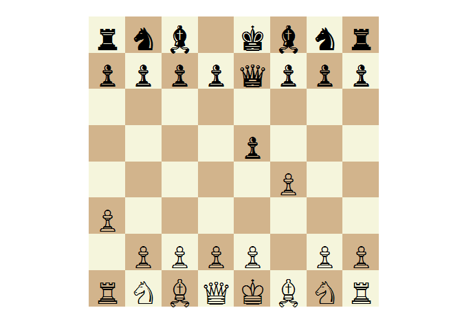
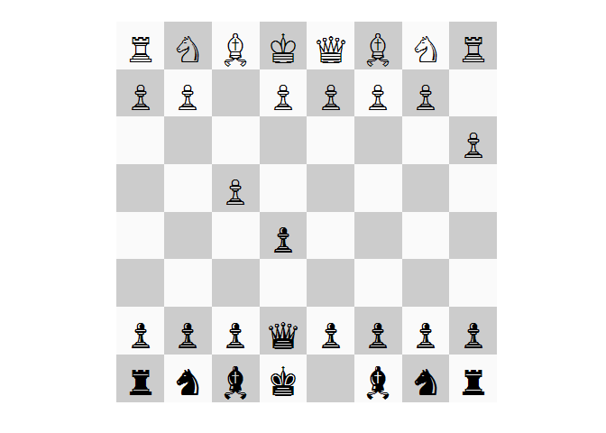
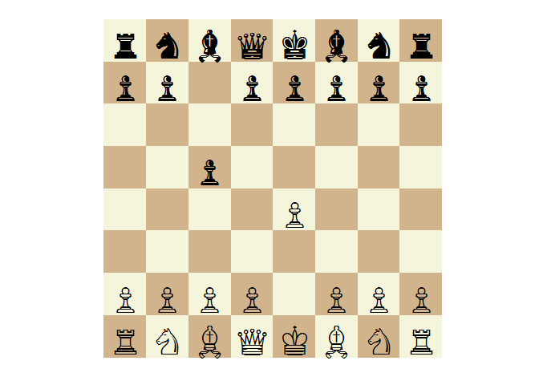

# Presenting `rchess` package
Joshua Kunst  


```r
library("rchess")
rm(list = ls())
```

## Basic Usage


```r
chss <- Chess$new()

chss
```

```
## 
## Turn
## w
## 
## Number of moves
## 0
## 
## History
## 
## 
## Fen representation
## rnbqkbnr/pppppppp/8/8/8/8/PPPPPPPP/RNBQKBNR w KQkq - 0 1
## 
## Board
##    +------------------------+
##  8 | r  n  b  q  k  b  n  r |
##  7 | p  p  p  p  p  p  p  p |
##  6 | .  .  .  .  .  .  .  . |
##  5 | .  .  .  .  .  .  .  . |
##  4 | .  .  .  .  .  .  .  . |
##  3 | .  .  .  .  .  .  .  . |
##  2 | P  P  P  P  P  P  P  P |
##  1 | R  N  B  Q  K  B  N  R |
##    +------------------------+
##      a  b  c  d  e  f  g  h
```

```r
chss$moves()
```

```
##  [1] "a3"  "a4"  "b3"  "b4"  "c3"  "c4"  "d3"  "d4"  "e3"  "e4"  "f3" 
## [12] "f4"  "g3"  "g4"  "h3"  "h4"  "Na3" "Nc3" "Nf3" "Nh3"
```

```r
chss$moves(verbose = TRUE)
```

```
## Source: local data frame [20 x 6]
## 
##    color  from    to flags piece   san
##    (chr) (chr) (chr) (chr) (chr) (chr)
## 1      w    a2    a3     n     p    a3
## 2      w    a2    a4     b     p    a4
## 3      w    b2    b3     n     p    b3
## 4      w    b2    b4     b     p    b4
## 5      w    c2    c3     n     p    c3
## 6      w    c2    c4     b     p    c4
## 7      w    d2    d3     n     p    d3
## 8      w    d2    d4     b     p    d4
## 9      w    e2    e3     n     p    e3
## 10     w    e2    e4     b     p    e4
## 11     w    f2    f3     n     p    f3
## 12     w    f2    f4     b     p    f4
## 13     w    g2    g3     n     p    g3
## 14     w    g2    g4     b     p    g4
## 15     w    h2    h3     n     p    h3
## 16     w    h2    h4     b     p    h4
## 17     w    b1    a3     n     n   Na3
## 18     w    b1    c3     n     n   Nc3
## 19     w    g1    f3     n     n   Nf3
## 20     w    g1    h3     n     n   Nh3
```

```r
chss$move("a3")
```

We can concate some moves and a capture


```r
chss$move("e5")$move("f4")$move("Qe7")$move("fxe5")

plot(chss)
```

<!--html_preserve--><div id="htmlwidget-3234" style="width:300px;height:300px;" class="chessboardjs"></div>
<script type="application/json" data-for="htmlwidget-3234">{"x":{"fen":"rnb1kbnr/ppppqppp/8/4P3/8/P7/1PPPP1PP/RNBQKBNR b KQkq - 0 3"},"evals":[]}</script><!--/html_preserve-->

```r
chss$turn()
```

```
## [1] "b"
```

```r
chss$square_color("h1")
```

```
## [1] "light"
```

```r
chss$get("e5")
```

```
## $type
## [1] "p"
## 
## $color
## [1] "w"
```

```r
chss$history(verbose = TRUE)
```

```
## Source: local data frame [5 x 7]
## 
##   color  from    to flags piece   san captured
##   (chr) (chr) (chr) (chr) (chr) (chr)    (chr)
## 1     w    a2    a3     n     p    a3       NA
## 2     b    e7    e5     b     p    e5       NA
## 3     w    f2    f4     b     p    f4       NA
## 4     b    d8    e7     n     q   Qe7       NA
## 5     w    f4    e5     c     p  fxe5        p
```

```r
chss$history()
```

```
## [1] "a3"   "e5"   "f4"   "Qe7"  "fxe5"
```

```r
chss$undo()
```

```
## $color
## [1] "w"
## 
## $from
## [1] "f4"
## 
## $to
## [1] "e5"
## 
## $flags
## [1] "c"
## 
## $piece
## [1] "p"
## 
## $captured
## [1] "p"
## 
## $san
## [1] "fxe5"
```

```r
chss$history()
```

```
## [1] "a3"  "e5"  "f4"  "Qe7"
```

```r
chss$fen()
```

```
## [1] "rnb1kbnr/ppppqppp/8/4p3/5P2/P7/1PPPP1PP/RNBQKBNR w KQkq - 1 3"
```

```r
chss$header("White", "You")

chss$header("Black", "Me")

cat(chss$pgn())
```

```
## [White "You"]
## [Black "Me"]
## 
## 1. a3 e5 2. f4 Qe7
```

```r
chss$ascii()
```

```
##    +------------------------+
##  8 | r  n  b  .  k  b  n  r |
##  7 | p  p  p  p  q  p  p  p |
##  6 | .  .  .  .  .  .  .  . |
##  5 | .  .  .  .  p  .  .  . |
##  4 | .  .  .  .  .  P  .  . |
##  3 | P  .  .  .  .  .  .  . |
##  2 | .  P  P  P  P  .  P  P |
##  1 | R  N  B  Q  K  B  N  R |
##    +------------------------+
##      a  b  c  d  e  f  g  h
```

## Generic Methods

### Summary


```r
summary(chss)
```

```
## 
## Turn
## w
## 
## Number of moves
## 4
## 
## History
## a3 e5 f4 Qe7
## 
## Fen representation
## rnb1kbnr/ppppqppp/8/4p3/5P2/P7/1PPPP1PP/RNBQKBNR w KQkq - 1 3
## 
## Board
##    +------------------------+
##  8 | r  n  b  .  k  b  n  r |
##  7 | p  p  p  p  q  p  p  p |
##  6 | .  .  .  .  .  .  .  . |
##  5 | .  .  .  .  p  .  .  . |
##  4 | .  .  .  .  .  P  .  . |
##  3 | P  .  .  .  .  .  .  . |
##  2 | .  P  P  P  P  .  P  P |
##  1 | R  N  B  Q  K  B  N  R |
##    +------------------------+
##      a  b  c  d  e  f  g  h
```

### Plot

Via `chessboardjs` htmlwidget implementation


```r
plot(chss)
```

<!--html_preserve--><div id="htmlwidget-8023" style="width:300px;height:300px;" class="chessboardjs"></div>
<script type="application/json" data-for="htmlwidget-8023">{"x":{"fen":"rnb1kbnr/ppppqppp/8/4p3/5P2/P7/1PPPP1PP/RNBQKBNR w KQkq - 1 3"},"evals":[]}</script><!--/html_preserve-->

If you dont like so much `chessboarjs` you can do vía ggplot2 with the `ggchessboard` function.


```r
plot(chss, type = "ggplot")
```

 

```r
plot(chss, type = "ggplot", cellcols = c("#CCCCCC", "#FAFAFA"), piecesize = 13, perspective = "black")
```

 

If you don't have a Chess object but a fen string you can do:


```r
fen <- "rnbqkbnr/pp1ppppp/8/2p5/4P3/8/PPPP1PPP/RNBQKBNR w KQkq c6 0 2"

chessboardjs(fen)
```

<!--html_preserve--><div id="htmlwidget-9795" style="width:300px;height:300px;" class="chessboardjs"></div>
<script type="application/json" data-for="htmlwidget-9795">{"x":{"fen":"rnbqkbnr/pp1ppppp/8/2p5/4P3/8/PPPP1PPP/RNBQKBNR w KQkq c6 0 2"},"evals":[]}</script><!--/html_preserve-->

```r
ggchessboard(fen)
```

 

### Print

Sames as summary (by now)


```r
print(chss)
```

```
## 
## Turn
## w
## 
## Number of moves
## 4
## 
## History
## a3 e5 f4 Qe7
## 
## Fen representation
## rnb1kbnr/ppppqppp/8/4p3/5P2/P7/1PPPP1PP/RNBQKBNR w KQkq - 1 3
## 
## Board
##    +------------------------+
##  8 | r  n  b  .  k  b  n  r |
##  7 | p  p  p  p  q  p  p  p |
##  6 | .  .  .  .  .  .  .  . |
##  5 | .  .  .  .  p  .  .  . |
##  4 | .  .  .  .  .  P  .  . |
##  3 | P  .  .  .  .  .  .  . |
##  2 | .  P  P  P  P  .  P  P |
##  1 | R  N  B  Q  K  B  N  R |
##    +------------------------+
##      a  b  c  d  e  f  g  h
```

## Other Functions

### Load Fen


```r
chss2 <- Chess$new()

chss2$plot()
```

<!--html_preserve--><div id="htmlwidget-8" style="width:300px;height:300px;" class="chessboardjs"></div>
<script type="application/json" data-for="htmlwidget-8">{"x":{"fen":"rnbqkbnr/pppppppp/8/8/8/8/PPPPPPPP/RNBQKBNR w KQkq - 0 1"},"evals":[]}</script><!--/html_preserve-->

```r
fen <- "rnbqkbnr/pp1ppppp/8/2p5/4P3/8/PPPP1PPP/RNBQKBNR w KQkq c6 0 2"

chss2$load(fen)
```

```
## [1] TRUE
```

```r
chss2$plot()
```

<!--html_preserve--><div id="htmlwidget-3914" style="width:300px;height:300px;" class="chessboardjs"></div>
<script type="application/json" data-for="htmlwidget-3914">{"x":{"fen":"rnbqkbnr/pp1ppppp/8/2p5/4P3/8/PPPP1PPP/RNBQKBNR w KQkq c6 0 2"},"evals":[]}</script><!--/html_preserve-->

### Load PGN


```r
pgn <- system.file("extdata/kasparov_vs_topalov.pgn", package = "rchess")
pgn <- readLines(pgn, warn = FALSE)
pgn <- paste(pgn, collapse = "\n")
cat(pgn)
```

```
## [Event "Hoogovens A Tournament"]
## [Site "Wijk aan Zee NED"]
## [Date "1999.01.20"]
## [EventDate "?"]
## [Round "4"]
## [Result "1-0"]
## [White "Garry Kasparov"]
## [Black "Veselin Topalov"]
## [ECO "B06"]
## [WhiteElo "2812"]
## [BlackElo "2700"]
## [PlyCount "87"]
## 
## 1. e4 d6 2. d4 Nf6 3. Nc3 g6 4. Be3 Bg7 5. Qd2 c6 6. f3 b5
## 7. Nge2 Nbd7 8. Bh6 Bxh6 9. Qxh6 Bb7 10. a3 e5 11. O-O-O Qe7
## 12. Kb1 a6 13. Nc1 O-O-O 14. Nb3 exd4 15. Rxd4 c5 16. Rd1 Nb6
## 17. g3 Kb8 18. Na5 Ba8 19. Bh3 d5 20. Qf4+ Ka7 21. Rhe1 d4
## 22. Nd5 Nbxd5 23. exd5 Qd6 24. Rxd4 cxd4 25. Re7+ Kb6
## 26. Qxd4+ Kxa5 27. b4+ Ka4 28. Qc3 Qxd5 29. Ra7 Bb7 30. Rxb7
## Qc4 31. Qxf6 Kxa3 32. Qxa6+ Kxb4 33. c3+ Kxc3 34. Qa1+ Kd2
## 35. Qb2+ Kd1 36. Bf1 Rd2 37. Rd7 Rxd7 38. Bxc4 bxc4 39. Qxh8
## Rd3 40. Qa8 c3 41. Qa4+ Ke1 42. f4 f5 43. Kc1 Rd2 44. Qa7 1-0
```

```r
chsspgn <- Chess$new()

chsspgn$load_pgn(pgn)
```

```
## [1] TRUE
```

```r
cat(chsspgn$pgn())
```

```
## [Event "Hoogovens A Tournament"]
## [Site "Wijk aan Zee NED"]
## [Date "1999.01.20"]
## [EventDate "?"]
## [Round "4"]
## [Result "1-0"]
## [White "Garry Kasparov"]
## [Black "Veselin Topalov"]
## [ECO "B06"]
## [WhiteElo "2812"]
## [BlackElo "2700"]
## [PlyCount "87"]
## 
## 1. e4 d6 2. d4 Nf6 3. Nc3 g6 4. Be3 Bg7 5. Qd2 c6 6. f3 b5 7. Nge2 Nbd7 8. Bh6 Bxh6 9. Qxh6 Bb7 10. a3 e5 11. O-O-O Qe7 12. Kb1 a6 13. Nc1 O-O-O 14. Nb3 exd4 15. Rxd4 c5 16. Rd1 Nb6 17. g3 Kb8 18. Na5 Ba8 19. Bh3 d5 20. Qf4+ Ka7 21. Rhe1 d4 22. Nd5 Nbxd5 23. exd5 Qd6 24. Rxd4 cxd4 25. Re7+ Kb6 26. Qxd4+ Kxa5 27. b4+ Ka4 28. Qc3 Qxd5 29. Ra7 Bb7 30. Rxb7 Qc4 31. Qxf6 Kxa3 32. Qxa6+ Kxb4 33. c3+ Kxc3 34. Qa1+ Kd2 35. Qb2+ Kd1 36. Bf1 Rd2 37. Rd7 Rxd7 38. Bxc4 bxc4 39. Qxh8 Rd3 40. Qa8 c3 41. Qa4+ Ke1 42. f4 f5 43. Kc1 Rd2 44. Qa7 1-0
```

```r
chsspgn$history()
```

```
##  [1] "e4"    "d6"    "d4"    "Nf6"   "Nc3"   "g6"    "Be3"   "Bg7"  
##  [9] "Qd2"   "c6"    "f3"    "b5"    "Nge2"  "Nbd7"  "Bh6"   "Bxh6" 
## [17] "Qxh6"  "Bb7"   "a3"    "e5"    "O-O-O" "Qe7"   "Kb1"   "a6"   
## [25] "Nc1"   "O-O-O" "Nb3"   "exd4"  "Rxd4"  "c5"    "Rd1"   "Nb6"  
## [33] "g3"    "Kb8"   "Na5"   "Ba8"   "Bh3"   "d5"    "Qf4+"  "Ka7"  
## [41] "Rhe1"  "d4"    "Nd5"   "Nbxd5" "exd5"  "Qd6"   "Rxd4"  "cxd4" 
## [49] "Re7+"  "Kb6"   "Qxd4+" "Kxa5"  "b4+"   "Ka4"   "Qc3"   "Qxd5" 
## [57] "Ra7"   "Bb7"   "Rxb7"  "Qc4"   "Qxf6"  "Kxa3"  "Qxa6+" "Kxb4" 
## [65] "c3+"   "Kxc3"  "Qa1+"  "Kd2"   "Qb2+"  "Kd1"   "Bf1"   "Rd2"  
## [73] "Rd7"   "Rxd7"  "Bxc4"  "bxc4"  "Qxh8"  "Rd3"   "Qa8"   "c3"   
## [81] "Qa4+"  "Ke1"   "f4"    "f5"    "Kc1"   "Rd2"   "Qa7"
```

```r
chsspgn$history(verbose = TRUE)
```

```
## Source: local data frame [87 x 7]
## 
##    color  from    to flags piece   san captured
##    (chr) (chr) (chr) (chr) (chr) (chr)    (chr)
## 1      w    e2    e4     b     p    e4       NA
## 2      b    d7    d6     n     p    d6       NA
## 3      w    d2    d4     b     p    d4       NA
## 4      b    g8    f6     n     n   Nf6       NA
## 5      w    b1    c3     n     n   Nc3       NA
## 6      b    g7    g6     n     p    g6       NA
## 7      w    c1    e3     n     b   Be3       NA
## 8      b    f8    g7     n     b   Bg7       NA
## 9      w    d1    d2     n     q   Qd2       NA
## 10     b    c7    c6     n     p    c6       NA
## ..   ...   ...   ...   ...   ...   ...      ...
```

### State validation


```r
chss2 <- Chess$new("rnb1kbnr/pppp1ppp/8/4p3/5PPq/8/PPPPP2P/RNBQKBNR w KQkq - 1 3")

plot(chss2)
```

<!--html_preserve--><div id="htmlwidget-6278" style="width:300px;height:300px;" class="chessboardjs"></div>
<script type="application/json" data-for="htmlwidget-6278">{"x":{"fen":"rnb1kbnr/pppp1ppp/8/4p3/5PPq/8/PPPPP2P/RNBQKBNR w KQkq - 1 3"},"evals":[]}</script><!--/html_preserve-->

```r
chss2$in_check()
```

```
## [1] TRUE
```

```r
chss2$in_checkmate()
```

```
## [1] TRUE
```

### Slatemate validation


```r
chss3 <- Chess$new("4k3/4P3/4K3/8/8/8/8/8 b - - 0 78")

plot(chss3)
```

<!--html_preserve--><div id="htmlwidget-9691" style="width:300px;height:300px;" class="chessboardjs"></div>
<script type="application/json" data-for="htmlwidget-9691">{"x":{"fen":"4k3/4P3/4K3/8/8/8/8/8 b - - 0 78"},"evals":[]}</script><!--/html_preserve-->

```r
chss3$in_stalemate()
```

```
## [1] TRUE
```

### 3 fold repetition


```r
chss4 <- Chess$new("rnbqkbnr/pppppppp/8/8/8/8/PPPPPPPP/RNBQKBNR w KQkq - 0 1")

chss4$in_threefold_repetition()
```

```
## [1] FALSE
```

```r
chss4$move('Nf3')$move('Nf6')$move('Ng1')$move('Ng8')
chss4$in_threefold_repetition()
```

```
## [1] FALSE
```

```r
chss4$move('Nf3')$move('Nf6')$move('Ng1')$move('Ng8')
chss4$in_threefold_repetition()
```

```
## [1] TRUE
```

```r
chss4$history()
```

```
## [1] "Nf3" "Nf6" "Ng1" "Ng8" "Nf3" "Nf6" "Ng1" "Ng8"
```

### Insufficient material


```r
chess5 <- Chess$new("k7/8/n7/8/8/8/8/7K b - - 0 1")
plot(chess5)
```

<!--html_preserve--><div id="htmlwidget-2660" style="width:300px;height:300px;" class="chessboardjs"></div>
<script type="application/json" data-for="htmlwidget-2660">{"x":{"fen":"k7/8/n7/8/8/8/8/7K b - - 0 1"},"evals":[]}</script><!--/html_preserve-->

```r
chess5$insufficient_material()
```

```
## [1] TRUE
```

```r
### INTERNAL ###
# ct <- rchess:::.get_context_chess_from_fen()
# ct$get(V8::JS("chess.get('a2')"))
# ct$eval(V8::JS("chess.move('a3')"))
# ct$eval(V8::JS("chess.move('d5')"))
# ct$get(V8::JS("chess.get('a3')"))
# cat(ct$get(V8::JS("chess.ascii()")))
# ct$assign("verb", TRUE)
# ct$get("chess.history({ verbose: verb})")
# ct$assign("fen", "no fen")
# ct$get("chess.validate_fen(fen)")
```


---
title: "test.R"
author: "Joshua K"
date: "Wed Oct 07 01:05:12 2015"
---
